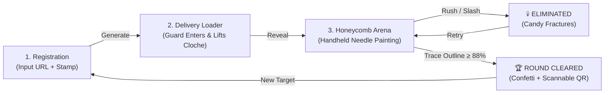

<div align="center">

# 🦑 SQUID CODE // DALGONA QR

### *Round 2: The Sugar Honeycomb QR Extraction Protocol*

[](https://pnpm.io)
[](https://react.dev)
[](https://vite.dev)
[](https://tailwindcss.com)
[](https://www.framer.com/motion/)
[](./LICENSE)

<p align="center">
  <b>A dystopian, interactive single-page application where users generate QR codes encased in fragile sugar honeycomb candy (Dalgona) and must trace the stamped shape with a handheld needle brush without shattering it.</b>
</p>

```
   ○  △  □
제2라운드 : 달고나 뽑기
"DO NOT MAKE SUDDEN MOVEMENTS. CARVE WITH A STEADY HAND."
```

</div>

---

## 🎯 Overview

**Squid Code** reimagines the iconic **Dalgona Honeycomb Challenge** (Episode 3: *The Man with the Umbrella*) as an interactive web experience. Instead of a traditional instant QR code generator, your target URL is imprinted at the base of a vintage tin container and submerged beneath caramelized sugar.

Players must **hold a realistic 3D needle tool** and **paint/carve along the stamped shape outline** (Circle, Triangle, Star, or Umbrella). Dragging with a gentle, measured cadence safely cuts the shape free and reveals the scannable code; dragging too fast surges the needle tension meter into critical stress, fracturing the confection with an **"ELIMINATED"** screen!

---

## 🎬 User Journey & State Machine



---

## ✨ Key Features & Engineering Highlights

### 🪡 1. Handheld 3D Needle Tool
- **Pointer-Locking Cursor**: Standard OS cursor is hidden over the arena (`cursor-none`) and replaced by a hardware-accelerated 3D needle graphic.
- **Pivot Precision**: Rotational transform pivot (`transformOrigin: '0px 15px'`) aligns with the microscopic pixel tip of the needle.
- **Dynamic Physics & Lighting**:
  - **Hovering**: Needle hovers at `-44°` with a soft diffuse shadow cast onto the sugar.
  - **Carving Contact**: When pressed (`pointerdown`), needle drops to `-34°`, shadow tightens, and the tip undergoes high-frequency micro-vibrations (`needle-wiggle`).
  - **Thermal Warning**: Dragging too fast overheats the needle tip into glowing molten red (`#ff0044`) with radial heat radiation.

### 🖌️ 2. Fine-Line Brush Painting Engine
- **Continuous Path Interpolation**: Trajectories between pointer coordinates are interpolated every `2.4px`, preventing gap artifacts during fast drags.
- **Micro-Groove Radius**: Precision needle radius ($6.0\text{px}$) designed to fit directly within the embossed honeycomb lines.
- **Particle Sugar Dust**: Dynamic emission of amber/gold sugar crumbs with velocity decay and gravity.
- **Real-Time Alpha Sampling**: Pixel analysis sampled via `ctx.getImageData()` to monitor exposed coverage without dropping frames.

### ⚠️ 3. Real-Time Cadence & Velocity Threshold
- **Physics Calculation**: Instantaneous pointer velocity ($\Delta\text{distance} / \Delta\text{time}$ in $\text{px/ms}$) smoothed via exponential moving average.
- **Brittle Sugar Threshold** ($> 0.65\text{ px/ms}$): Rapid slashing overpressures the candy. If stress hits $100\%$, structural cracks shoot across the surface, triggering the elimination siren.
- **Stress Dissipation**: Pausing or slowing down dissipates tension, rewarding patience and precision.

### 📐 4. Geometric Perimeter Extraction
- You don't need to erase the whole puck—**completing the stamped shape is enough!**
- Generates mathematical checkpoint coordinates along:
  - **`△ Triangle`**: 3 perimeter line segments.
  - **`○ Circle`**: 36 radial perimeter points.
  - **`★ Star`**: 10 inner/outer star edge facets.
  - **`☂ Umbrella`**: Top canopy arc, 4 bottom scallops, and handle stem.
- Reaching $\ge 88\%$ perimeter extraction pops the outer candy off cleanly and unleashes `canvas-confetti`.

### 🎵 5. Dual Audio System & Official Soundtrack
- **Original Series Soundtrack**: Automatically plays the show's theme (*"Pink Soldiers"* / *"Way Back Then"*) from [`public/sounds/squid-game-theme.mp3`](./public/sounds/squid-game-theme.mp3).
- **Procedural Web Audio Fallback**: An embedded Web Audio API synthesizer generates the eerie recorder melody, woodblock clicks, brittle sugar cracks, and elimination buzzers in real time with zero external network dependencies.
- **Tactile Scratch Audio**: Dynamic friction scraping throttled to $48\text{ms}$ while carving.

---

## 🗂️ Project Structure

```
squid-code/
├── public/
│   └── sounds/
│       ├── squid-game-theme.mp3  # Authentic show soundtrack loop
│       ├── buzzer.mp3            # Series elimination alert sound
│       ├── doll-chant.mp3        # Series audio cue
│       └── README.md             # Sound specifications
├── src/
│   ├── components/
│   │   ├── DalgonaGame.jsx       # Canvas carving engine & 3D needle tool
│   │   ├── GuardLoader.jsx       # Framer Motion pink guard & cloche dome
│   │   └── InputScreen.jsx       # Minimalist dystopian URL & stamp selector
│   ├── hooks/
│   │   └── useGameAudio.js       # use-sound + procedural WebAudio synth
│   ├── App.jsx                   # Phase state machine & navigation
│   ├── index.css                 # Tailwind CSS v4, neon glows & scanlines
│   └── main.jsx                  # React 19 root
├── package.json
├── vite.config.js                # Vite + Tailwind v4 plugin
├── pnpm-lock.yaml                # pnpm lockfile
└── README.md
```

---

## 🛠️ Tech Stack

| Technology | Role |
| :--- | :--- |
| **[pnpm](https://pnpm.io)** | Fast, disk space efficient package manager |
| **[React 19](https://react.dev)** | Modern component architecture & hooks |
| **[Vite 8](https://vite.dev)** | Next-gen lightning-fast dev server and bundler |
| **[Tailwind CSS v4](https://tailwindcss.com)** | Modern utility styling with `@theme` and `@import "tailwindcss"` |
| **[Framer Motion](https://www.framer.com/motion/)** | Fluid character animations for the pink guard & stage transitions |
| **[HTML5 Canvas](https://developer.mozilla.org)** | Procedural sugar puck generation & organic `destination-out` chipping |
| **[qrcode.react](https://github.com/zpao/qrcode.react)** | SVG QR code generator with high error correction |
| **[use-sound](https://github.com/joshwcomeau/use-sound)** | Web audio playback for show soundtracks and sound effects |
| **[Web Audio API](https://developer.mozilla.org)** | Built-in procedural synthesis fallback for offline audio feedback |
| **[canvas-confetti](https://www.npmjs.com/package/canvas-confetti)** | Multi-cannon celebration fireworks on successful extraction |

---

## 🎮 Controls & Interactions

| Action | Control |
| :--- | :--- |
| **Hold & Carve** | **Click + Drag** (or **Touch + Drag** on mobile) |
| **Skip Intro Delivery** | Click **`SKIP INTRO [ESC]`** or press `Esc` |
| **Toggle Soundtrack** | Click **`OST ON / OFF`** button in the top navigation |
| **Mute All Audio** | Click the **Speaker icon** in the top navigation |
| **Download Extracted QR** | Click **`DOWNLOAD QR`** (exports high-res 512×512 PNG) |
| **Reset Game** | Click **`NEW TARGET`** or **`CANCEL & RETURN`** |

---

## ⚡ Quickstart with pnpm

### Prerequisites
Make sure you have [Node.js](https://nodejs.org) (v18 or higher) and [pnpm](https://pnpm.io) installed:
```bash
corepack enable
corepack prepare pnpm@latest --activate
```

### 1. Clone the Repository
```bash
git clone https://github.com/Josheqani/squid-code.git
cd squid-code
```

### 2. Install Dependencies
```bash
pnpm install
```

### 3. Start Development Server
```bash
pnpm dev
```
Open your browser at `http://localhost:5173`.

### 4. Build for Production
```bash
pnpm run build
```

### 5. Lint the Codebase
```bash
pnpm run lint
```

---

## 📜 License

This project is licensed under the [MIT License](./LICENSE).

---

<div align="center">
  <sub>Built with precision for players of Squid Game. Remember: slow, steady brush strokes keep you alive.</sub>
</div>
